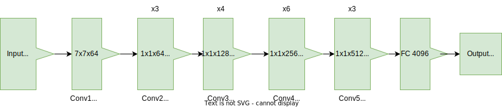
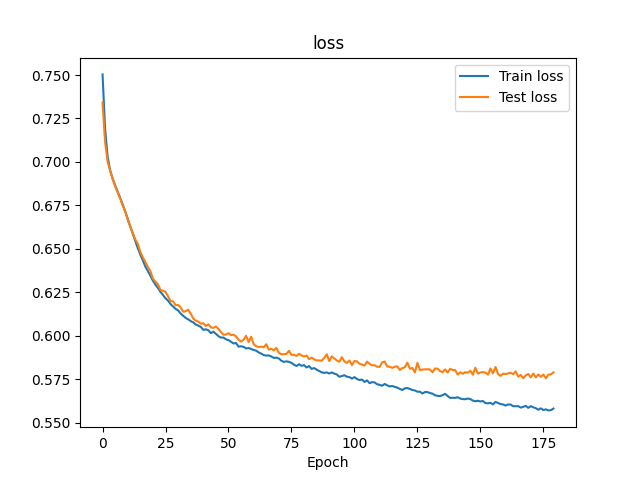
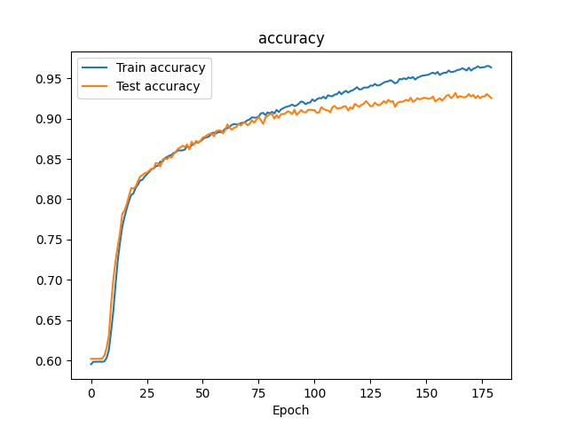
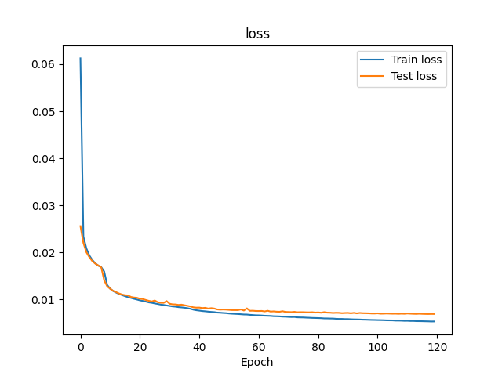

# ml-art

This repository contains code to extract a 4096 dimensional representation of art images using two different architectures...

## ResnNet-50

**Architecture**
Here is the modified ResNet-50 architecture ...:

The resulted volumes after each convolution operations ... :

**Results**

Loss                    |  Accuracy
:----------------------:|:-------------------------:
 |  

## Autoencoder

...

**Architecture**

...

**Results**

 ...
 
 

# License

* Free software: MIT

# Contribute

# FAQ

* Please contact us at [engineer@hi-paris.fr](engineer@hi-paris.fr)

# References
